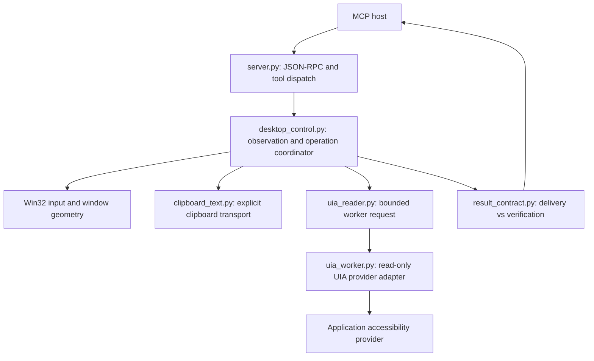
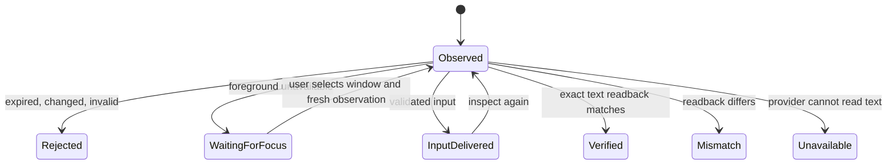

# Architecture: observe, deliver, verify

## Visible activity and motion scheduling (1.9.0)

`activity.py` sends operation/state/time events through a bounded queue to a
separate native Win32 overlay process. No MCP JSON-RPC output is written by the
helper. NOACTIVATE and disabled-window styles prevent it from taking focus or
receiving mouse hits. Native painting keeps text readable despite disabled state.
The indicator is best-effort and is not used to infer whether an input succeeded.

`motion.py` separates interpolation/timing from Win32 validation and movement
callbacks. A monotonic absolute schedule prevents per-frame validation cost from
accumulating into timing drift. Smoothstep easing reduces abrupt acceleration;
late frames are skipped, but the final point is always emitted. Safety checks
remain before each delivered point, and exceptions still unwind drag cleanup.
This intentionally favors target correctness over claiming constant 60 FPS.

Version 1.8.0 makes a critical distinction explicit: successful input injection
is not successful application behavior. A Windows input API can accept every
event while the editor transforms Unicode or the destination rejects a drop.

## Layers

### Observation and validation

An observation binds HWND, PID, executable path, and physical client geometry.
The in-memory ID expires after 60 seconds and is consumed by an action. UI element
actions also revalidate runtime ID, name, control type, automation ID, and bounds.
These are freshness checks, not authentication or a sandbox. The application can
change between any two calls; Windows does not make screenshots and input atomic.

### Precision and arrival (1.11.0)

Three independent things can move a click off its intended point, and each is now
checked rather than assumed.

**Coordinate space.** The process sets `PER_MONITOR_AWARE_V2` at import and each tool
call also sets a per-thread context. Without the process-wide context, a capture taken
outside a tool call — `mimo_capture_window` is the live example — is virtualized to
96 DPI, so the same window reports different pixel geometry depending on the caller.
Setting it once removes that inconsistency; the per-thread set remains for hosts that
change their own context between calls.

**Arrival.** `SetCursorPos` returns success even when the desktop clamps the point to
the virtual desktop bounds. A click built on that success would land somewhere else
while every call in the sequence still looked fine. Every move is therefore read back
with `GetCursorPos` and compared; a mismatch raises and no button event is sent.

**Element hit point.** A rectangle centre is not always a valid hit point: an overlay
can cover it, and a partially scrolled element can put it outside the client area.
Element clicks prefer the provider's `GetClickablePoint` and fall back to the centre,
and reject a point outside the visible client area with a message that says so.

All three fail closed: an unverified position produces an error, never a click.

### Delivery adapters

- **Unicode SendInput:** retained for compatibility and apps where it works.
  KEYEVENTF_UNICODE reaches the application's input path, where IMEs or app logic
  may transform it. The server cannot fix that by counting injected events.
- **Explicit clipboard paste:** `desktop_paste_text` publishes CF_UNICODETEXT and
  sends Ctrl+V after rechecking foreground. It is the recommended mixed-script path.
  It does not silently change the default of the existing typing API, select all,
  restore old clipboard contents, or automatically retry an incorrect insertion.
- **Mouse drag:** coordinate motion plus button/modifier events. Cross-window
  pickup and drop dwell are configurable; during dwell the target and Escape state
  are checked every 25 ms plus provider/check overhead. Cleanup attempts release
  even after failure. This is not an OLE IDataObject/IDropTarget implementation.

Clipboard allocation uses movable global memory; ownership transfers to Windows
only after SetClipboardData succeeds. A private message-only window provides
clipboard ownership. Text remains in the clipboard because an asynchronous paste
may read it after the tool returns; an immediate restore would introduce a race.

## Result contract

| Operation | Result meaning |
|---|---|
| Input operation | `outcome: input_delivered`, `verification: not_performed` |
| Exact text readback matches | `outcome: verified`, `matched: true` |
| Exact text differs | `outcome: mismatch`, `matched: false` |
| Provider cannot expose text | `outcome: unavailable`, `matched: null` |
| Window geometry | `geometry_verified` or `geometry_mismatch` |
| Wait condition observed | `outcome: condition_met`, `satisfied: true` |
| Wait reached its timeout | `outcome: condition_not_met`, `satisfied: false` |

`ok` retains backward-compatible meaning: the operation returned normally.
Clients must inspect `outcome`/`verification` to determine what evidence exists.
`verified` is scoped to a particular text assertion, not the entire task.
Name-only checks remain a separate tool and cannot prove document contents.

## Exact text verification

1. Inspect the editor after input, obtaining a fresh element observation.
2. Select the actual editor element, not the window title or a toolbar button.
3. Call `desktop_verify_text` with `expected_text`.
4. The coordinator revalidates the element and requests readback in the worker.
5. The worker tries UIA ValuePattern, then TextPattern. It compares exact text
   without whitespace normalization and returns the result without actual contents.

Expected text is limited to 2,000 characters and sent through subprocess stdin,
not command-line arguments. TextPattern reads at most 4,097 characters so it can
detect over-limit content. ValuePattern has no length parameter and can return a
larger value before the limit check. Password controls are not traversed or read.
There is no OCR-based guess, and unavailable providers never count as a match.

One long-lived worker process serves every provider call (1.10.0). Requests and
responses are newline-delimited JSON, serialized because the coordinator is
single-threaded. A reader thread drains stdout so the eight-second deadline can be
enforced without blocking on a partial response, and each worker owns its own queue
so a replaced worker's reader cannot deliver a stale line to its successor.

The worker is discarded, never reused, after a timeout, a crash, or an unreadable
response; the next call starts a fresh one. A worker that answers with a provider
error is kept, because a provider that responded is not a broken transport.
Discarding is safe because that worker has no mutation commands. An operation can
perform more than one provider call, so this is not an eight-second overall tool
deadline.

## Waiting is not acting (1.10.0)

`desktop_wait_for` polls a read-only predicate — a visible window title, a vanished
handle, or a present UI Automation element — until it holds or `timeout_ms` elapses.
It sends no input and needs no observation, so it cannot consume a token, take
foreground, or disturb the target. That separation is deliberate: the existing
"never retry automatically" rule is about injected input, and a bounded read-only poll
is the safe way to let a host wait for a UI change instead of sleeping blindly.

A timeout is reported as `satisfied: false` with `outcome: condition_not_met`. The
condition was not observed within the budget, which is a different statement from
"the operation failed", and the caller must inspect the window before deciding what
to do next.

Because `element_present` asks the provider on every attempt, its interval has a
500 ms floor and a single attempt can overrun the timeout by up to one provider
deadline. The tool bounds the number of attempts, not wall-clock precision. A
provider that errors during a wait raises rather than counting as "not yet present",
so an unreadable provider can never be mistaken for a satisfied condition.

## Recovery states

The host orchestrates this sequence; it is not an automatic workflow engine.
No operation automatically repeats a paste or drop. A refused activation suppresses
further activation attempts for that target until foreground is observed manually.
This respects Windows focus arbitration instead of injecting unrelated Alt keys
or forcing thread-input attachment. It does not eliminate user focus assistance.

## Drag reliability and limits

`pickup_ms` defaults to 150 and `drop_ms` to 300; both accept 50–2,000 ms.
These waits give the source/destination processing time and can be tuned, but
they do not prove why a particular Explorer-to-Notepad drop failed. Window geometry,
target visibility, input cleanup, and readback are separate concerns. The release
does not automatically verify file-open semantics and does not claim universal
drag-and-drop acceptance. An app-specific postcondition is still required.

## Tests and evidence

Unit tests cover contracts, identity changes, clipboard failures, and invalid dwell.
Live fixture tests check real window input and native editor text readback, including
a same-length-independent exact comparison and deliberate mismatch. These complement
but do not replace user testing with Notepad, Explorer, specific IMEs, and custom apps.
