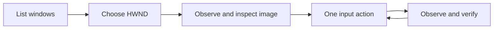

<div align="center">

# MiMo Desktop MCP

### See the window. Choose the action. Control the desktop.

A local MCP server for Windows desktop interaction and Xiaomi MiMo AI workflows.

[](https://github.com/akaradje/mimo-desktop/actions/workflows/tests.yml)
[](LICENSE)


**Window screenshots · Unicode input · Smooth dragging · Cross-window drops · Live MiMo events**

[Quick start](#quick-start) · [Desktop workflows](#desktop-workflows) · [Tool reference](#tool-reference) · [Testing](#testing) · [Troubleshooting](#troubleshooting)

</div>

---

MiMo Desktop MCP connects an MCP-compatible assistant to two useful surfaces:
**Windows application windows** and the **local Xiaomi MiMo AI Desktop API**.
It provides small, explicit actions rather than a single opaque automation script.
An assistant observes a window, inspects the image, performs an action, and observes
again to check the result.

This is an independent community project. It is not affiliated with or endorsed
by Xiaomi, Microsoft, or the Model Context Protocol maintainers.

## Why this project?

| Capability | What it gives you |
|---|---|
| **28 focused tools** | Desktop input and MiMo API operations in one stdio server |
| **Window-scoped images** | Capture a chosen client area without a full-desktop screenshot fallback |
| **Unicode typing** | Enter text such as Thai directly, without replacing clipboard contents |
| **Smooth mouse gestures** | Left/right/middle drag, waypoints, and adjustable duration |
| **Cross-window interaction** | Drag between two observed windows with optional Ctrl/Shift/Alt |
| **Checks before input** | One-use observations, expiration, foreground and geometry validation |
| **Cleanup on failure** | Attempt to release mouse buttons and modifiers even after an interrupted drag |
| **Bounded event streaming** | SSE parsing with line, frame, and queue limits plus loss accounting |

Input delivery does not prove task success. The destination application decides
whether it accepts a drop, a shortcut, or text. Inspect the result after each action.

## Requirements

- Windows 10/11 with an unlocked interactive desktop for live UI actions.
- Python **3.11 or later**. Windows CI is configured for 3.11, 3.12, and 3.13.
- [Pillow](https://pypi.org/project/Pillow/) for PNG encoding and screenshot checks.
- An MCP host supporting local **stdio** servers.
- Xiaomi MiMo AI Desktop, running with its local Desktop API available, for `mimo_*`
  API tools. The generic `desktop_*` tools do not require MiMo to be running.

The implementation uses Python's standard library and Win32 via `ctypes`, plus
Pillow and pywinauto for UI Automation. No cloud service or separate automation daemon is started by this server.

## Quick start

### 1. Clone and install

In PowerShell, choose a folder where you keep source projects:

```powershell
git clone https://github.com/akaradje/mimo-desktop.git
cd mimo-desktop
py -3 -m venv .venv
& .\.venv\Scripts\python.exe -m pip install -r requirements.txt
```

You do not need to activate the virtual environment. The examples invoke its
Python executable directly, so they do not require changing PowerShell policy.

### 2. Register in MiMo

Edit `%USERPROFILE%\.config\mimocode\mimocode.jsonc` and merge the following
entry into its existing `mcp` object. Replace both paths with **absolute paths**
to your clone and virtual environment. Preserve your other settings.

```json
{
  "mcp": {
    "mimo-desktop": {
      "type": "local",
      "command": [
        "C:\\Tools\\mimo-desktop\\.venv\\Scripts\\python.exe",
        "C:\\Tools\\mimo-desktop\\server.py"
      ],
      "enabled": true
    }
  }
}
```

Reload the MCP server or restart the host engine after changing code or
configuration. A process already running keeps its loaded code. Depending on the
host, you may also need a new conversation to refresh tool discovery.

### 3. Register in another MCP host

Hosts using the common `mcpServers` configuration shape can use:

```json
{
  "mcpServers": {
    "mimo-desktop": {
      "command": "C:\\Tools\\mimo-desktop\\.venv\\Scripts\\python.exe",
      "args": ["C:\\Tools\\mimo-desktop\\server.py"]
    }
  }
}
```

The exact configuration location is host-specific. This server speaks
newline-delimited JSON-RPC over stdio; it is not an HTTP MCP endpoint and does
not use LSP `Content-Length` framing. Starting `server.py` manually and seeing no
output is normal: it is waiting for MCP requests on stdin.

### 4. Verify discovery

```powershell
& .\.venv\Scripts\python.exe test_mcp_client.py
```

The client initializes the server, discovers **28 tools**, checks basic calls and
errors, and verifies shutdown. Its MiMo screenshot check is explicitly skipped if
the MiMo window is unavailable or minimized. A skipped check is not a capture pass.

Suggested first request to your assistant:

> List my visible windows, observe the intended test window, and describe it.
> Do not type or submit anything yet.

## Desktop workflows

### Visible activity and smoother input (1.9.0)

A small **MIMO DESKTOP** badge now appears near the top-right of the primary
display while a `desktop_*` tool is running. It shows the operation name, elapsed
seconds, and a completion, error, or waiting-for-focus message. It is disabled and
non-activating, so it does not receive clicks or take foreground. Normal results
remain visible for about three seconds; a focus-wait message for about twelve.
It reports MCP tool activity, not the model's thinking between calls, and does not
claim task success. MiMo API-only operations do not use this desktop indicator.

The indicator is enabled by default. Set the MCP server environment variable
`MIMO_DESKTOP_OVERLAY=0` before launch to disable it. Reload the MCP process after
updating: an old process will not display the new badge. The helper uses a bounded
background queue and cannot block desktop input if the visual channel fails. Its
messages contain only operation/state/timing, never typed text or window titles.
This is best-effort UI telemetry; a helper startup failure does not fail the action.

Pointer travel before clicks uses a short 180 ms eased movement. Drag interpolation
uses smoothstep acceleration/deceleration on a monotonic deadline schedule, with
approximately 60 planned frames per second. Slow validation skips overdue frames
instead of adding a full extra delay each frame. The exact endpoint is retained;
this is not a guarantee of a fixed frame rate under CPU/GPU or application load.
Wheel requests are delivered one tick at a time, 30 ms apart, with foreground and
Escape checks. App-specific scroll animation still depends on the application.

To test the badge without touching application content:

```powershell
python test_activity_live.py --run
```

### Delivery is not verification (1.8.0)

See [ARCHITECTURE.md](ARCHITECTURE.md) for the layers, state transitions, Win32/COM
choices, timeout scope, and known limitations.

Use **`desktop_paste_text`** for reliable mixed-script entry through the clipboard.
It deliberately replaces clipboard contents and sends Ctrl+V; select existing text
and observe again first if replacing an editor. Existing `desktop_type_text` keeps
its Unicode default for compatibility and now warns about app/IME conversion.

Input results now say `outcome: input_delivered`, `verification: not_performed`.
After entering text, call `desktop_inspect`, choose the actual editor element, then:

```json
{
  "observation_id": "<fresh editor observation>",
  "element_index": 5,
  "expected_text": "ทดสอบ mimo-desktop สำเร็จ"
}
```

Send these arguments to **`desktop_verify_text`**. It reads ValuePattern or
TextPattern and returns `verified`, `mismatch`, or `unavailable`. It compares exact
characters, not just length; does not return actual document text; and does not
pretend that unsupported providers passed. Expected text is limited to 2,000
characters. A new inspection is required after each action.

For cross-window drag, optional `pickup_ms` (default 150) and `drop_ms` (default 300)
allow 50–2,000 ms of application processing time. Target/Escape checks continue
during these waits. A drop still needs an app-specific postcondition; longer dwell
does not prove that every destination accepts the data.

### UI Automation and verified layout (1.7.0)

Update dependencies with `python -m pip install -r requirements.txt`, then reload
the MCP process. There are now 26 tools.

`desktop_inspect` takes `hwnd` and optional `focus`, returning a screenshot and
an `elements` array. Each row contains an `element_index`, UIA runtime identity,
name, control type, automation ID, enabled/visible flags, and screen rectangle.
Choose the intended element from this observation, then call
`desktop_click_element` with its `observation_id` and `element_index`.

Before clicking, the tool reads UIA again and rejects changed identity, name,
control type, automation ID, or rectangle. It clicks the element's center using
the existing foreground and occlusion checks. It is not an InvokePattern action
and cannot operate invisible controls. Reinspect afterwards to verify the result.

`desktop_verify_element` compares a freshly inspected element's accessible name
with `expected_name`, returning `matched`. This is a narrow, explicit assertion:
it does not read or verify an entire editor document. Truncated names cannot pass
an exact match. The name limit is 500 characters; password controls are omitted.

UIA reads run in a separate process with an 8-second timeout, up to 200 visited
nodes and depth 8. The tree can be incomplete; not every custom canvas or app
provides useful accessibility data. Capture and UIA reads are sequential rather
than atomic. Treat names and all other application content as untrusted data.

For diagnostics, `uia_worker.py` performs the same read outside the server: pass
the request on stdin as `{"hwnd": N}` (or `hwnd` positionally) and it prints one
JSON line, while `--serve` runs the line-delimited loop the server uses. A provider
that is slow to answer — a busy Chromium renderer is the usual case — can exceed the
8-second budget, which surfaces as `UI Automation timed out`. Retry the inspect
instead of concluding the window is unsupported; the same window often answers in
under two seconds on the next attempt.

Use `desktop_set_window_rect` to arrange windows directly instead of dragging a
custom title/tab strip. Pass an observation ID and `x`, `y`, `width`, `height` in
physical **screen** pixels for the entire window including its frame. The tool
returns `requested`, `actual`, and `matched`. Applications can impose size limits;
`ok: true` with `matched: false` means Windows accepted the call but the geometry
differs. Capture again before using client coordinates.

Desktop results include `elapsed_ms` on normal completion. Common state/argument
and operation failures now return structured status, invalidate observations, and
set `retry_automatically: false`. These controls improve diagnosability; they do
not establish superiority over another computer-use system or remove OS limits.

### Observe → act → verify



1. Call `desktop_list_windows` and select the intended window by title, executable
   path, and HWND. Do not guess a handle.
2. Call `desktop_observe` with that `hwnd` and `focus: true`.
3. Inspect the returned image and save its `observation_id`.
4. Perform one input using that ID.
5. Observe again before the next input, including after an error.

Coordinates are **physical pixels in the returned client-area image**. `(0, 0)`
is its top-left corner, not the screen or title bar. If your UI scales the preview,
map the point back to the image's original dimensions. The server uses per-thread
DPI awareness to keep capture and input coordinates consistent.

Observations expire after **60 seconds** and are consumed by input. A new
observation normally clears the old one. `retain_previous: true` keeps up to eight
distinct window observations for a cross-window gesture. Observing the same window
replaces its earlier observation; a failed observation clears the cache.

### Precision guarantees

Three checks keep a click on the point that was observed, and all three fail closed —
an unverified position produces an error, never a click:

- **One coordinate space.** The process is per-monitor DPI aware, so a capture taken
  outside a tool call reports the same physical geometry as one taken inside it, even
  on a scaled display.
- **Verified arrival.** Every pointer move is read back with `GetCursorPos`.
  `SetCursorPos` reports success even when the desktop clamps the point, so a clamped
  move raises instead of letting the click land somewhere else.
- **Real element hit point.** Element clicks use the provider's clickable point when it
  exposes one, and reject an element whose click point lies outside the visible client
  area rather than clicking a clamped position.

### Waiting instead of guessing

`desktop_wait_for` polls a read-only condition, so you do not have to re-observe in a
loop or sleep for a fixed time:

| Condition | Required arguments | Satisfied when |
|---|---|---|
| `window_visible` | `title_contains` | A visible titled window matches |
| `window_gone` | `hwnd` | The handle is no longer valid or visible |
| `element_present` | `hwnd` plus exactly one of `name_contains` / `name_exact` | A UI Automation element matches |

`timeout_ms` (100–30000, default 5000) and `interval_ms` (50–2000, default 250) bound
the wait, and Escape cancels it. The tool sends no input and needs no
`observation_id`, so waiting cannot consume a token or disturb the target. A timeout
returns `satisfied: false` with `outcome: condition_not_met` — that is the answer, not
an error. `element_present` asks the provider on every attempt, so its interval has a
500 ms floor and one attempt can take up to eight seconds; the timeout is checked
between attempts, not during one.

`desktop_list_windows` accepts the same kind of narrowing: `title_contains`,
`path_contains` (matches the executable path, so the file name works), and an exact
`pid`. All three are case-insensitive substring matches except `pid`. The reply keeps
`total_visible`, the unfiltered count, so a filter that hides everything is
distinguishable from a desktop with no windows.

### Click and type

After observing, click the intended editor. Observe once more to check focus, then
type using the new observation ID:

```json
{
  "observation_id": "<new observation ID>",
  "text": "Hello — สวัสดี"
}
```

`desktop_type_text` accepts 1–2000 printable characters. Use `desktop_press_key`
for control keys such as `Enter` or `Tab`; typing literal text does not submit it.
Supported chords include `Ctrl+A`, `Ctrl+Shift+S`, and `Alt+F4`. Their effects depend
on the focused application and keyboard layout.

#### Mixed-script text and IME recovery (1.6.1)

Some applications or active IMEs can transform Unicode input events. If the
observed text is incorrect, select the incorrect text first, observe again, then
request explicit clipboard mode:

```json
{
  "observation_id": "<fresh ID after selecting the incorrect text>",
  "text": "ทดสอบ mimo-desktop สำเร็จ",
  "method": "clipboard"
}
```

This replaces the clipboard with the supplied Unicode text and sends Ctrl+V.
The text remains on the clipboard; previous contents are not restored because
applications may consume a paste asynchronously. Default `method: unicode` does
not modify the clipboard. There is no automatic fallback that could duplicate
already-entered text. Inspect the result; neither mode verifies editor contents.

`Target is not foreground` means no input should be retried until a fresh
`desktop_observe` with `focus: true` succeeds. `Observation expired or already
used` means capture again and use the new ID. Each action consumes its ID,
including an attempted action that later fails validation. Do not reuse the ID
from a click to type, or the ID from Ctrl+A to paste.

Starting with **1.6.2**, focus failures return a structured tool error:

```json
{
  "ok": false,
  "status": "waiting_for_focus",
  "hwnd": 12345,
  "retry_automatically": false,
  "observation_invalidated": true
}
```

This is an immediate response, not a background wait. Select the target manually,
then observe again for a fresh ID. After Windows refuses an activation request,
repeated `focus: true` calls for that window do not call SetForegroundWindow again
until the server observes it already in foreground. This suppression is scoped
to the current MCP process. Errors do not undo earlier input or clipboard changes.

### Drag inside a window

Use `desktop_drag` after inspecting the source image:

```json
{
  "observation_id": "<source observation ID>",
  "from_x": 100,
  "from_y": 100,
  "to_x": 400,
  "to_y": 300,
  "via": [{"x": 250, "y": 120}],
  "button": "left",
  "modifiers": ["shift"],
  "duration_ms": 1000
}
```

Replace the example coordinates with points from your image. `via` is optional
and accepts up to **64 waypoints**. The button can be `left`, `right`, or `middle`.
Modifiers can include unique `ctrl`, `shift`, and `alt` names. Duration is
**100–10000 ms**, plus validation overhead; movement targets roughly 60 updates
per second. All points must stay inside the source client area.

Hold **Escape** to cancel a running drag. Cancellation is not undo: a partial
selection, drawing, or drop may remain. Cleanup attempts button/modifier release
up to three times; it cannot guarantee delivery if Windows rejects input or the
server is forcibly terminated.

### Drag across windows

Use `desktop_drag_between`:

1. Arrange source and destination so both gesture endpoints are visible.
2. Observe the **destination** and inspect its image.
3. Observe the **source** with `focus: true` and `retain_previous: true`.
4. Inspect the source image and pass both observation IDs:

```json
{
  "observation_id": "<source observation ID>",
  "destination_observation_id": "<destination observation ID>",
  "from_x": 100,
  "from_y": 120,
  "to_x": 250,
  "to_y": 180,
  "button": "left",
  "modifiers": ["ctrl"],
  "duration_ms": 1200
}
```

`from_x/y` use source image coordinates; `to_x/y` use destination image coordinates.
Both tokens are consumed. The server checks both window identities and geometries,
destination visibility, and foreground ownership throughout the gesture. Its
straight screen path can hover over intermediate windows, which may react to it.

Inspect the destination afterwards. Ctrl often changes drag semantics, but the
meaning is application-specific. These tools deliver input; they do not implement
every application's drag-and-drop protocol or guarantee that a file was transferred.

### Scroll

`desktop_scroll` requires an observation ID, client `x/y`, and nonzero `ticks`
between -20 and 20. Positive ticks scroll **up** vertically or **right** horizontally.
One tick is 120 Windows wheel units. Set `axis` to `vertical` or `horizontal`.

## Tool reference

### Windows desktop — 15 tools

| Tool | Purpose |
|---|---|
| `desktop_list_windows` | Visible titled windows, HWND, PID, path; optional title/path/pid filters |
| `desktop_wait_for` | Read-only wait for a window or element condition |
| `desktop_observe` | Client-area screenshot, optional focus, and one-use observation ID |
| `desktop_click` | Single/double left, right, or middle click |
| `desktop_type_text` | Literal Unicode text without clipboard replacement |
| `desktop_press_key` | Named keys, navigation, F1–F12, and Ctrl/Alt/Shift chords |
| `desktop_scroll` | Vertical or horizontal wheel input at a chosen point |
| `desktop_drag` | Single-window drag with waypoints and optional modifiers |
| `desktop_drag_between` | Drag between two observed windows |
| `desktop_inspect` | Screenshot and bounded UI Automation tree |
| `desktop_click_element` | Revalidate and click an observed UI element |
| `desktop_verify_element` | Exact accessible-name comparison |
| `desktop_set_window_rect` | Move/resize and report actual window geometry |
| `desktop_paste_text` | Explicit clipboard text transport for mixed scripts |
| `desktop_verify_text` | Exact editor text comparison through UIA patterns |

### MiMo integration — 14 tools

| Tool | Purpose |
|---|---|
| `mimo_status` | Process, shortcut, and Desktop API status |
| `mimo_resolve_shortcut` | Resolve the Start Menu shortcut |
| `mimo_launch` | Launch MiMo and wait for API readiness |
| `mimo_quit` | Graceful close; optional force termination |
| `mimo_focus_window` | Restore and focus MiMo |
| `mimo_health` | Local Desktop API health |
| `mimo_desktop_api_info` | API metadata without returning the full token |
| `mimo_list_sessions` | Session summaries |
| `mimo_get_messages` | Summarized session messages |
| `mimo_send_message` | Submit a turn to a selected session |
| `mimo_send_and_watch` | Subscribe, submit, collect events, optionally reconcile messages |
| `mimo_watch_events` | Bounded SSE collection without submitting a turn |
| `mimo_capture_window` | MiMo-only screenshot and optional file output |
| `mimo_get_preferences` | Allowlisted preference fields |

`tools/list` returns the full input schema for every tool. Calls that submit turns,
close apps, or send input have real side effects; use them within the user's intent.

## MiMo API and event architecture

The app writes its current loopback port and bearer token to:

```text
%APPDATA%\Xiaomi MiMo AI\desktop-api.json
```

The server reads this file at runtime. Do not copy it into this repository or
hardcode its token. Ports can change when the app restarts.

`mimo_send_and_watch` opens SSE on one connection and submits the turn on another.
The event stream has no replay. Receiving its `meta` event is a practical readiness
signal, **not a formal subscription barrier**; optional message reconciliation helps
inspect the final state.

| Bound | Default |
|---|---|
| JSON HTTP body | 16 MiB; oversized responses raise an explicit error |
| SSE line | 64 KiB |
| SSE frame data | 256 KiB |
| SSE queue | 200 events |

The SSE reader consumes decoded HTTP body bytes, not raw chunk headers. The ordered
queue drops older non-control events on overflow and reports loss counters.
Lifecycle control events are bounded. `history_complete` describes collection
accounting; it does not establish that the application replayed historical events.

The server advertises MCP protocol version `2024-11-05`. Host compatibility is
tested at the stdio contract level; it is not a claim of certification across hosts.

## Testing

### Local tests without desktop input

```powershell
& .\.venv\Scripts\python.exe -m unittest test_desktop_control test_api_body test_clipboard_text test_uia_reader test_result_contract test_motion test_activity
& .\.venv\Scripts\python.exe test_sse_stress.py
```

The first command covers **64 cases**, including stale observations, occlusion,
Unicode input construction, drag cleanup, modifiers, and HTTP response bounds.
The second covers **13 SSE scenarios** using a local fixture server.

### Opt-in real-input tests

```powershell
& .\.venv\Scripts\python.exe test_desktop_live.py --run
& .\.venv\Scripts\python.exe test_cross_window_live.py --run
```

These open disposable Tk windows and move the pointer/type into those windows.
Avoid interacting with the desktop during the short run. They cover eight
single-window scenarios and two cross-window payload drops, including Ctrl.
The cross-window test verifies real events and a Tk drop handler, **not Windows
OLE file transfer**. They are not run in hosted CI.

### Opt-in live UI Automation test

```powershell
& .\.venv\Scripts\python.exe test_uia_live.py --run
```

Covers the two tools that need a real provider: `desktop_wait_for` with
`element_present`, and `desktop_verify_text`. It derives its expected names and
text from the live provider rather than hardcoding them, so it works on any
desktop. It sends no input, but `desktop_verify_text` requires the target window
in front, so the window that was in front is restored on exit. Pass
`--hwnd N` to choose the text target; otherwise it scans visible windows for the
first `Edit` or `Document` control.

### Live MiMo checks

```powershell
& .\.venv\Scripts\python.exe test_mcp_client.py
& .\.venv\Scripts\python.exe test_live_soak_readonly.py
```

The soak requires a running MiMo API and an available session for full coverage.
It performs four read-only API checks; it does not submit messages or close MiMo.
Test output may include local session metadata, so sanitize logs before sharing.
`_acl_test.py` is an additional local diagnostic for screenshot-directory ACLs.

Test counts describe this release's suite. Passing these checks does not prove
compatibility with every app, GPU state, display arrangement, or MCP host.

## Troubleshooting

| Symptom | What to check |
|---|---|
| No tools appear | Verify absolute paths, install Pillow in the configured Python, reload the host |
| Old tool count/version | Restart the MCP process; an existing process retains loaded code |
| Server looks idle in a terminal | Expected: it waits for JSON-RPC on stdin |
| Observation expired/already used | Capture a fresh image before the next action |
| Target is not foreground | Observe with `focus: true`; manually select it if Windows refuses activation |
| Point/destination is covered | Arrange the windows so the endpoint is visible, then observe both again |
| Cannot send input to an app | Check whether it is elevated or running on a protected desktop |
| Blank/failed screenshot | Restore the window; some protected or GPU surfaces reject PrintWindow |
| Drop has no effect | Inspect app behavior; it may reject the data type, modifiers, or drop location |
| MiMo API unavailable | Start MiMo and check that its `desktop-api.json` exists; never share the token |
| Thai text works but a shortcut differs | Shortcut handling depends on the app and active keyboard layout |

There is no UAC bypass, secure-desktop automation, automatic elevation, or
full-desktop screenshot fallback. UI Automation is available where the application exposes it.
Window content can change without moving the window; validation cannot make input
atomic with an observation. See [SECURITY.md](SECURITY.md) for the trust model.

## Project layout

```text
mimo-desktop/
├── server.py                    # MiMo tools, MCP transport, capture, SSE
├── desktop_control.py           # Window-scoped Win32 input and drag tools
├── test_desktop_control.py      # Mocked input and failure-path regression tests
├── test_api_body.py             # HTTP response-bound regression tests
├── test_sse_stress.py           # Local streaming fixtures
├── test_mcp_client.py           # Independent stdio MCP client
├── test_desktop_live.py         # Opt-in disposable single-window input test
├── test_cross_window_live.py    # Opt-in two-window drop test
├── test_uia_live.py             # Opt-in live UI Automation provider test
├── test_live_soak_readonly.py   # Read-only running-MiMo checks
├── _acl_test.py                 # Local ACL diagnostics
├── requirements.txt
└── .github/workflows/tests.yml # Windows unit/SSE CI
```

## Contributing and license

Bug reports with sanitized reproductions are welcome. Read
[CONTRIBUTING.md](CONTRIBUTING.md), review the [changelog](CHANGELOG.md), and avoid
committing credentials, screenshots, or session histories.

Released under the **[MIT License](LICENSE)**. Use, modify, and redistribute it
with the license notice included.
